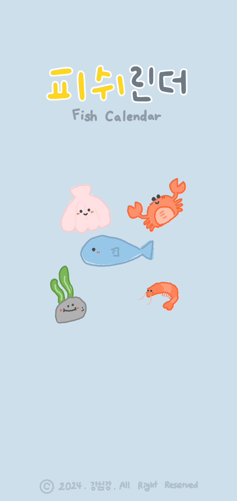

# Fishlendar_App



Fishlendar_App은 사용자가 해양생물별 조업, 채집 금지 기간 관리와 일정을 관리할 수 있도록 도와주는 캘린더 애플리케이션입니다.

## 주요 기능

- **해양생물 선택**: 조업, 채집 금지 기간을 관리할 생물을 선택할 수 있습니다.
- **일정 관리**: 일정을 추가, 수정, 삭제할 수 있습니다.

## 설치 방법

1. 이 레포지토리를 클론합니다:

   ```bash
   git clone https://github.com/dain2822/Fishlendar_App.git

2. 프로젝트 디렉토리로 이동합니다:

   ```bash
  cd Fishlendar_App

3. 필요한 패키지를 설치합니다:

   ```bash
  cd install
  
4. 애플리케이션을 실행합니다:

   ```bash
  cd start

## 사용 예시

1. 일정 추가: 우측 하단의 '+' 버튼을 눌러 새로운 일정을 추가할 수 있습니다.
2. 일정 수정: 일정을 클릭하여 세부 정보를 수정할 수 있습니다.
3. 일정 삭제: 일정을 길게 눌러 삭제 옵션을 선택할 수 있습니다.
